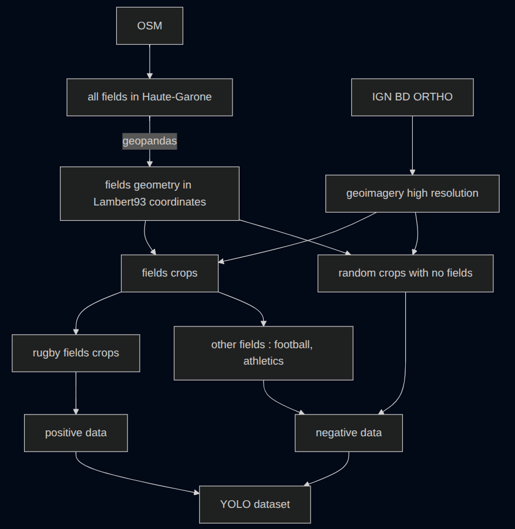
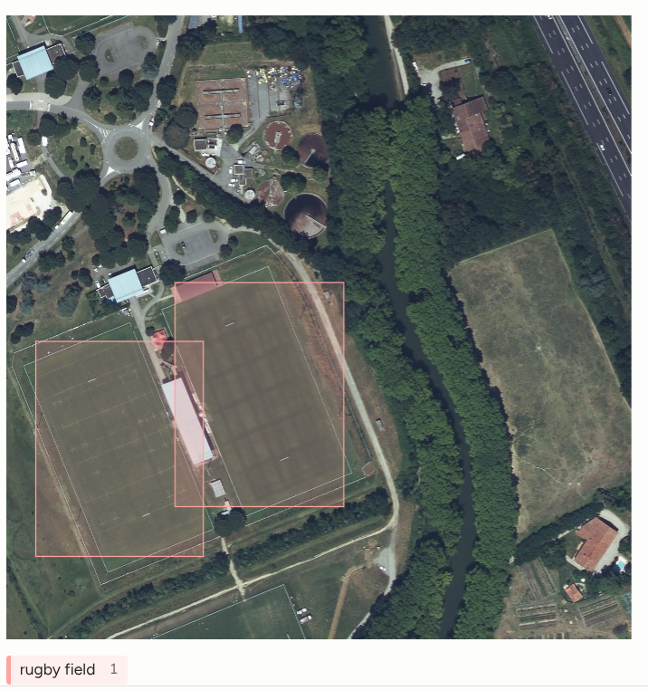
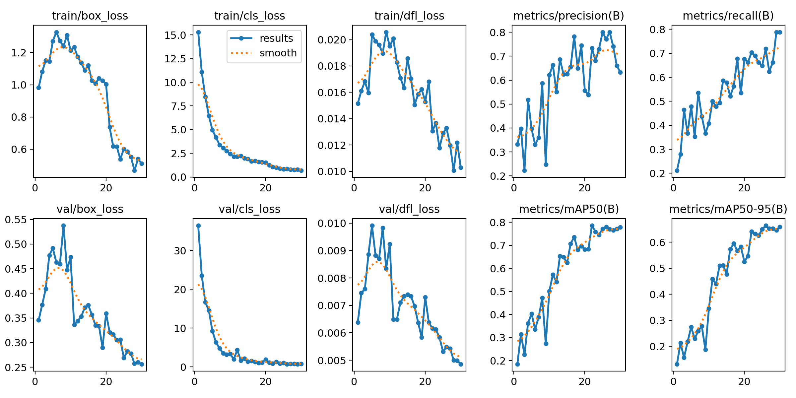
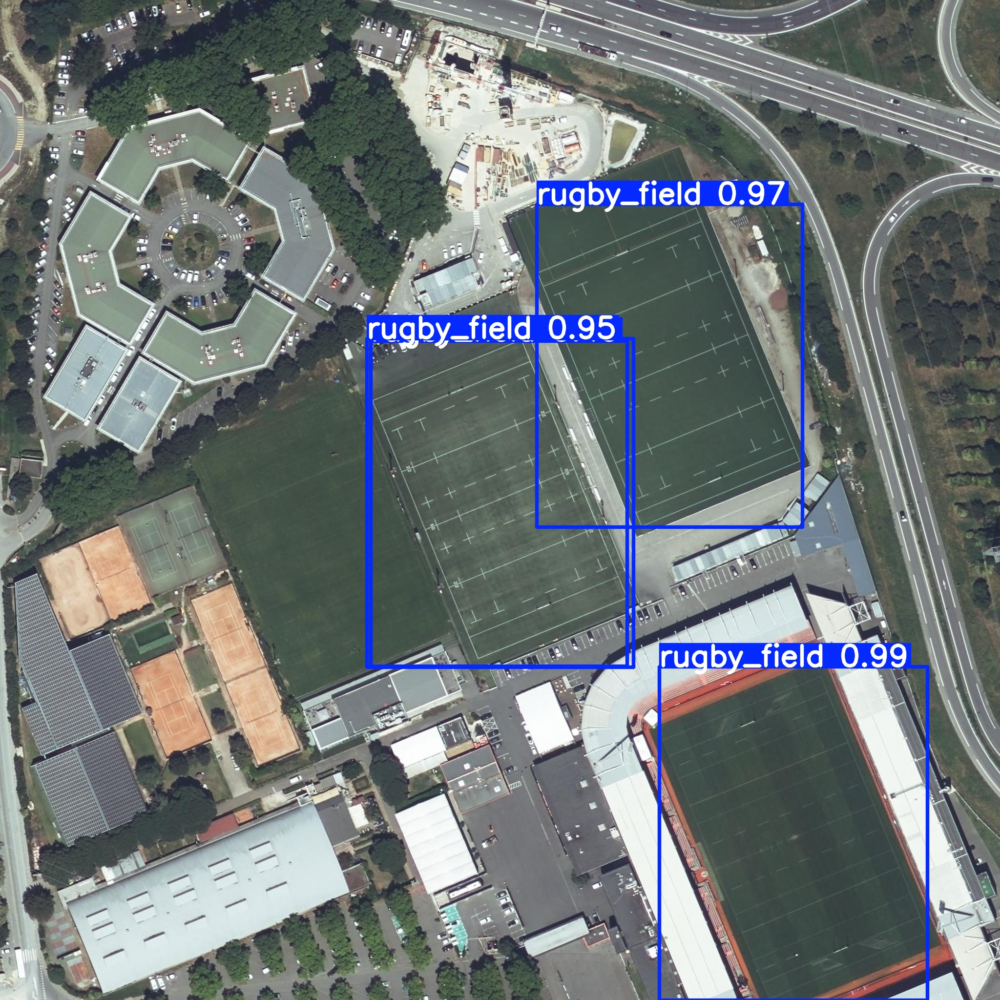
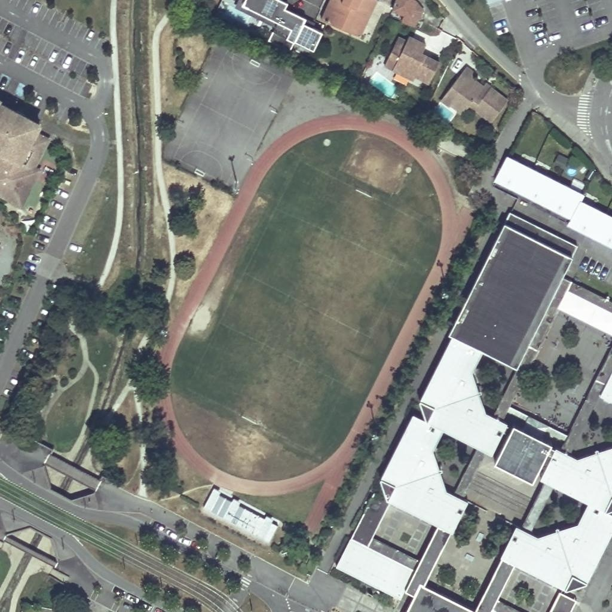

# Rugby Fields

A computer vision project aiming to automatically detect rugby fields on
high-resolution aerial imagery.

The long-term objective is to build a complete pipeline capable of
estimating the number and location of rugby fields across France using
publicly available geographic data.

This project started as a personal challenge to build an end-to-end 
computer vision pipeline, from geospatial data processing to object 
detection on aerial imagery.

------------------------------------------------------------------------

# Project overview

Unlike many computer vision projects, no annotated dataset exists for
this task.

Instead of manually collecting thousands of images, this project focuses 
on building an automated pipeline to generate a training dataset from public 
geospatial data, which represents the core challenge of the project.

The workflow is:

``` text
OpenStreetMap
        │
        ▼
Rugby field geometries
        │
        ▼
IGN BD ORTHO aerial imagery
        │
        ▼
Automatic crop extraction
        │
        ▼
Manual verification & annotation
        │
        ▼
YOLO dataset
        │
        ▼
Model training
        │
        ▼
Detection on unseen orthophotos
```

------------------------------------------------------------------------

# Dataset generation

The dataset is entirely built from publicly available data.

## Imagery

-   IGN BD ORTHO (https://www.data.gouv.fr/datasets/bd-ortho-r)
-   20 cm spatial resolution
-   Initial experiments performed on the Haute-Garonne department

## Field locations

Field geometries are extracted from OpenStreetMap using Overpass
queries.

The pipeline automatically:

-   converts coordinates from WGS84 to Lambert-93;
-   finds the corresponding orthophoto tile;
-   extracts several crops around each field;
-   generates initial YOLO annotations.

The complete data generation pipeline is illustrated below.



Since OpenStreetMap data is not always perfectly up to date, every crop
is manually verified before training.

------------------------------------------------------------------------

# Dataset v1

The first version of the dataset was entirely built in-house. The goal was 
not only to collect positive samples, but also difficult negative examples 
to improve the robustness of the detector.

Current dataset:

  Type                 Images
  ------------------ --------
  Rugby fields            276
  Negative samples        509
  Total                   785

Negative samples intentionally include football fields, athletics tracks
and other visually similar areas to reduce false positives.

Bounding boxes were manually corrected using Label Studio.

Example of a crop annotated on Label Studio :


------------------------------------------------------------------------

# Model

Current detector:

-   YOLO26n
-   Single class (`rugby_field`)

Training performed on Google Colab.

------------------------------------------------------------------------

# Results

These metrics were obtained on the current internal validation split. Because the dataset contains geographically and visually related crops, they should be considered preliminary and may overestimate performance on entirely unseen regions. A geographically separated test set is currently being developed.

## Baseline

  Parameter    Value
  ------------ ---------
  Model        YOLO26n
  Image size   640 px
  Epochs       30
  Batch size   4

Results:

-   Precision ≈ 0.65
-   Recall ≈ 0.79
-   mAP50 ≈ 0.78
-   mAP50-95 ≈ 0.66

Training curves showed that the model was still improving after 30
epochs.



## Current best experiment

  Parameter    Value
  ------------ ---------
  Model        YOLO26n
  Image size   1024 px
  Epochs       100
  Batch size   4

Results:

Initial results are promising on the current validation set, but further evaluation on geographically independent imagery is required before drawing conclusions about generalization.

Example prediction on the facilities of the greatest club in the world (Stade Toulousain) :



| Metric    | Value |
| --------- | ----: |
| Precision |  0.90 |
| Recall    |  0.92 |
| mAP50     | 0.967 |
| mAP50-95  |  0.86 |

The remaining failures mostly correspond to poorly contrasted fields with barely visible markings.


------------------------------------------------------------------------

# Repository structure

## Repository structure

```text
rugby-fields/
├── configs/
├── data/
│   └── yolo_dataset/
├── docs/
├── experiments/
├── models/
├── src/
└── README.md
```

The dataset, training configuration and trained models are versioned
independently to ensure experiments remain reproducible.


-----------------------------------------------------------------------

# Technical stack

- Python
- PyTorch
- Ultralytics YOLO26
- Rasterio
- GeoPandas
- PyProj
- OpenStreetMap
- IGN BD ORTHO
- Label Studio
- QGIS
- Google Colab

------------------------------------------------------------------------

# Next steps

-   Increase dataset diversity with more departments.
-   Improve discrimination between rugby and football fields.
-   Run inference on complete orthophoto tiles.
-   Build a nationwide detection pipeline.
