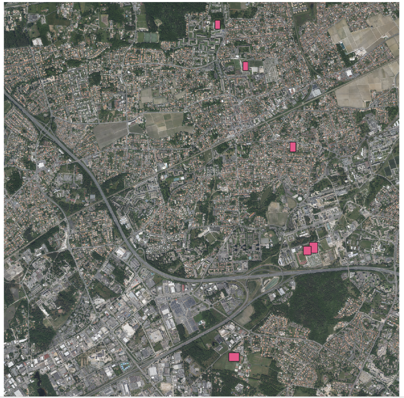

# Rugby Fields

A computer vision project aiming to automatically detect rugby fields on high-resolution aerial imagery.

The long-term objective is to build a complete geospatial pipeline capable of estimating the number and location of rugby fields across France using publicly available geographic data.

Unlike many object detection projects, this work does not rely on an existing dataset. Instead, the project focuses on building an end-to-end workflow, from automatic dataset generation to large-scale inference on orthophotos.

---

# Project overview

No public dataset exists for rugby field detection on aerial imagery.

Rather than manually collecting thousands of annotated images, this project builds an automated pipeline that generates a training dataset from public geospatial data before training a YOLO detector.

The complete workflow is illustrated below.

```text
OpenStreetMap
        │
        ▼
Field geometries
        │
        ▼
IGN BD ORTHO imagery
        │
        ▼
Automatic crop extraction
        │
        ▼
Manual verification & annotation
        │
        ▼
YOLO dataset
        │
        ▼
Model training
        │
        ▼
Inference on complete orthophotos
```

---

# Dataset generation

The dataset is entirely built from publicly available data.

## Imagery

-   IGN BD ORTHO (https://www.data.gouv.fr/datasets/bd-ortho-r)
-   20 cm spatial resolution
-   Initial experiments performed on the Haute-Garonne department

## Field locations

Field geometries are extracted from OpenStreetMap using Overpass
queries.

The pipeline automatically:

-   converts coordinates from WGS84 to Lambert-93;
-   finds the corresponding orthophoto tile;
-   extracts several crops around each field;
-   generates initial YOLO annotations.

The complete data generation pipeline is illustrated below.


Since OpenStreetMap data is not always perfectly up to date, every crop
is manually verified before training.

------------------------------------------------------------------------

# Dataset v1

The first version of the dataset was entirely built in-house.

The objective was not only to collect rugby fields but also difficult negative examples to reduce false detections.

| Type             |  Images |
| ---------------- | ------: |
| Rugby fields     |     276 |
| Negative samples |     509 |
| **Total**        | **785** |

Negative samples intentionally include football fields, athletics tracks
and other visually similar areas to reduce false positives.

Bounding boxes were manually corrected using Label Studio.

Example of a crop annotated on Label Studio :


------------------------------------------------------------------------

# Model

Current detector:

-   YOLO26n
-   Single class (`rugby_field`)

Training performed on Google Colab.

------------------------------------------------------------------------

# Results

These metrics were obtained on the current internal validation split. Because the dataset contains geographically and visually related crops, they should be considered preliminary and may overestimate performance on entirely unseen regions. A geographically separated test set is currently being developed.

## Baseline

  Parameter    Value
  ------------ ---------
  Model        YOLO26n
  Image size   640 px
  Epochs       30
  Batch size   4

Results:

-   Precision ≈ 0.65
-   Recall ≈ 0.79
-   mAP50 ≈ 0.78
-   mAP50-95 ≈ 0.66

Training curves showed that the model was still improving after 30
epochs.


## Current best experiment

  Parameter    Value
  ------------ ---------
  Model        YOLO26n
  Image size   1024 px
  Epochs       100
  Batch size   4

Results:

Initial results are promising on the current validation set, but further evaluation on geographically independent imagery is required before drawing conclusions about generalization.

Example prediction on the facilities of the greatest club in the world (Stade Toulousain) :


| Metric    | Value |
| --------- | ----: |
| Precision |  0.90 |
| Recall    |  0.92 |
| mAP50     | 0.967 |
| mAP50-95  |  0.86 |

The remaining failures mostly correspond to poorly contrasted fields with barely visible markings.


------------------------------------------------------------------------

# Inference pipeline

The project now includes a complete inference pipeline capable of processing full-resolution IGN BD ORTHO tiles instead of isolated image crops.

The pipeline automatically:

* converts JP2 orthophotos into RGB images;
* splits each orthophoto into inference tiles;
* runs YOLO detection on every tile;
* converts detections back into Lambert-93 coordinates;
* merges overlapping predictions using Non-Maximum Suppression;
* exports the final detections as a GeoPackage.

The resulting GeoPackage can be directly visualized in GIS software such as QGIS, making it possible to inspect detections on complete orthophoto tiles while preserving their geographic coordinates.



---

# Large-scale inference

The first end-to-end experiments have been performed on complete orthophoto tiles from the Gironde department, which was not used during the initial training.

The detector successfully identifies most rugby fields while keeping the number of false positives relatively low.

Visual inspection also revealed several limitations of the current model:

* some poorly contrasted rugby fields are still missed;
* a few football fields are incorrectly detected as rugby fields;
* some bounding boxes require more accurate localization.

These observations suggest that the overall pipeline is operational, while highlighting the need for a more diverse training dataset before large-scale deployment.

---

# Repository structure

```text
rugby-fields/
├── configs/
├── data/
│   └── yolo_dataset/
├── docs/
├── experiments/
├── models/
├── src/
│   ├── data-preprocessing/
│   ├── yolo_model/
│   └── inference/
└── README.md
```

Datasets, model weights and experiments are versioned independently to ensure reproducibility.

---

# Technical stack

* Python
* PyTorch
* Ultralytics YOLO26
* Rasterio
* GeoPandas
* PyProj
* OpenStreetMap
* IGN BD ORTHO
* Label Studio
* QGIS
* Google Colab

---

# Roadmap

* Build a geographically more diverse training dataset.
* Create a geographically independent benchmark for evaluation.
* Retrain the detector on the updated dataset.
* Improve discrimination between rugby and football fields.
* Run inference at the scale of complete French departments.
* Estimate the number and location of rugby fields across France.
