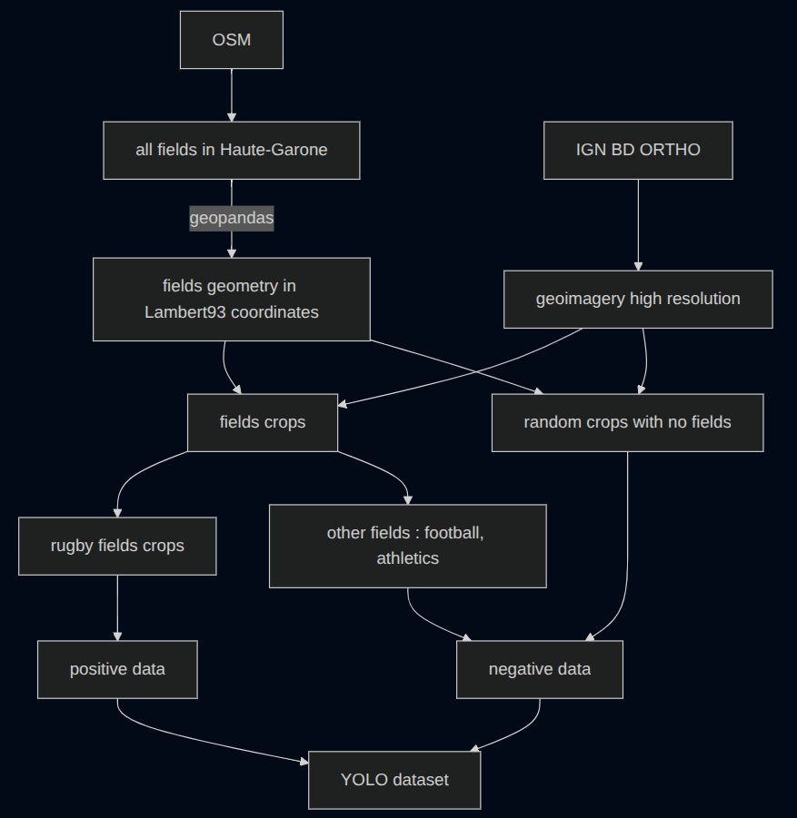
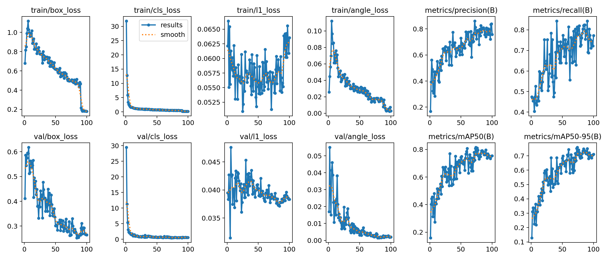
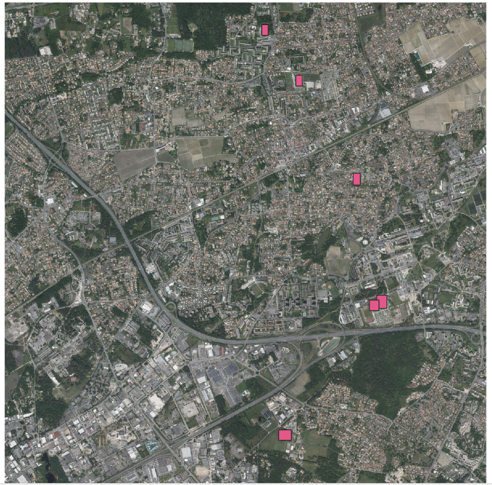

# Rugby Fields

A computer vision project aiming to automatically detect rugby fields on high-resolution aerial imagery.

The long-term objective is to build a complete geospatial pipeline capable of estimating the number and location of rugby fields across France using publicly available geographic data.

Unlike many object detection projects, this work does not rely on an existing dataset. Instead, the project focuses on building an end-to-end workflow, from automatic dataset generation to large-scale inference on orthophotos.

---

# Project overview

No public dataset exists for rugby field detection on aerial imagery.

Rather than manually collecting thousands of annotated images, this project builds an automated pipeline that generates a training dataset from public geospatial data before training a YOLO detector.

The complete workflow is illustrated below.

```text
OpenStreetMap
        │
        ▼
Field geometries
        │
        ▼
IGN BD ORTHO imagery
        │
        ▼
Automatic crop extraction
        │
        ▼
Manual verification & annotation
        │
        ▼
YOLO dataset
        │
        ▼
Model training
        │
        ▼
Inference on complete orthophotos
```

---

# Dataset generation

The dataset is entirely built from publicly available data.

## Imagery

-   IGN BD ORTHO (https://www.data.gouv.fr/datasets/bd-ortho-r)
-   20 cm spatial resolution
-   Initial experiments performed on the Haute-Garonne department

## Field locations

Field geometries are extracted from OpenStreetMap using Overpass
queries.

The pipeline automatically:

-   converts coordinates from WGS84 to Lambert-93;
-   finds the corresponding orthophoto tile;
-   extracts several crops around each field;
-   generates initial YOLO annotations.

The complete data generation pipeline is illustrated below.



Since OpenStreetMap data is not always perfectly up to date, every crop
is manually verified before training.

------------------------------------------------------------------------

# Dataset

The dataset is built entirely in-house from IGN BD ORTHO imagery and OpenStreetMap geometries. It contains both positive examples of rugby fields and difficult negative examples such as football fields, athletics tracks and other visually similar areas.

All annotations are manually reviewed and corrected in Label Studio. The current version uses **oriented bounding boxes (OBB)** so that rotated fields can be localized more precisely than with standard axis-aligned bounding boxes.

## Dataset evolution

The initial dataset was created from imagery covering Haute-Garonne. It was progressively expanded with additional geographic areas, including Hautes-Pyrénées, in order to increase visual diversity and reduce overfitting to a single department.

The current training protocol uses a strict geographic split:

| Split | Geographic area | Purpose |
|---|---|---|
| Training | Haute-Garonne and Hautes-Pyrénées | Model fitting |
| Validation | Gironde | Evaluation on a geographically independent area |

No crop from Gironde is used during training. This department-level separation prevents spatial leakage between the training and validation sets and provides a more realistic estimate of the model's ability to generalize to unseen imagery.

Negative samples remain an important part of the dataset and intentionally include structures that can be confused with rugby fields, especially football pitches and athletics facilities.

------------------------------------------------------------------------


# Model

Current detector:

-   YOLO26n-OBB
-   Single class (`rugby_field`)
-   Oriented bounding boxes for rotated field localization

Training performed on Google Colab.

------------------------------------------------------------------------

# Results

The current results were obtained with an **OBB detector** trained on Haute-Garonne and Hautes-Pyrénées and evaluated exclusively on Gironde.

Because the validation department is geographically independent from the training data, these metrics do not suffer from crop-level or location-level leakage. They therefore provide a substantially more rigorous estimate of generalization than the earlier random internal split.

## Current OBB experiment

| Parameter | Value |
|---|---:|
| Model | YOLO26n-OBB |
| Task | Single-class oriented object detection |
| Training epochs | 100 |
| Best epoch | 74 |
| Training areas | Haute-Garonne, Hautes-Pyrénées |
| Validation area | Gironde |

Metrics at the best epoch, selected using validation mAP50-95:

| Metric | Value |
|---|---:|
| Precision | 0.758 |
| Recall | 0.814 |
| mAP50 | 0.815 |
| mAP50-95 | 0.759 |

The best validation performance was reached at epoch 74. The model achieved a strong balance between detection and localization quality on a department that was never seen during training.

The gap compared with the earlier internal validation metrics is expected: the current protocol is more difficult and more representative of real deployment, where the model must process imagery from new geographic areas with different ground appearance, lighting, field conditions and surrounding infrastructure.

Training and validation curves:



These results confirm that the detector generalizes beyond its training departments, while leaving room for improvement on poorly contrasted fields and visually ambiguous football facilities.

------------------------------------------------------------------------


# Inference pipeline

The project now includes a complete inference pipeline capable of processing full-resolution IGN BD ORTHO tiles instead of isolated image crops.

The pipeline automatically:

* converts JP2 orthophotos into RGB images;
* splits each orthophoto into inference tiles;
* runs YOLO detection on every tile;
* converts detections back into Lambert-93 coordinates;
* merges overlapping predictions using Non-Maximum Suppression;
* exports the final detections as a GeoPackage.

The resulting GeoPackage can be directly visualized in GIS software such as QGIS, making it possible to inspect detections on complete orthophoto tiles while preserving their geographic coordinates.



---

# Large-scale inference

The first end-to-end experiments have been performed on complete orthophoto tiles from the Gironde department, which was not used during the initial training.

The detector successfully identifies most rugby fields while keeping the number of false positives relatively low.

Visual inspection also revealed several limitations of the current model:

* some poorly contrasted rugby fields are still missed;
* a few football fields are incorrectly detected as rugby fields;
* some bounding boxes require more accurate localization.

These observations suggest that the overall pipeline is operational, while highlighting the need for a more diverse training dataset before large-scale deployment.

---

# Repository structure

```text
rugby-fields/
├── configs/
├── data/
│   └── yolo_dataset/
├── docs/
├── experiments/
├── models/
├── src/
│   ├── data-preprocessing/
│   ├── yolo_model/
│   └── inference/
└── README.md
```

Datasets, model weights and experiments are versioned independently to ensure reproducibility.

---

# Technical stack

* Python
* PyTorch
* Ultralytics YOLO26
* Rasterio
* GeoPandas
* PyProj
* OpenStreetMap
* IGN BD ORTHO
* Label Studio
* QGIS
* Google Colab

---

# Roadmap

* Build a geographically more diverse training dataset.
* Run inference at the scale of complete French departments.
* Estimate the number and location of rugby fields across France.
