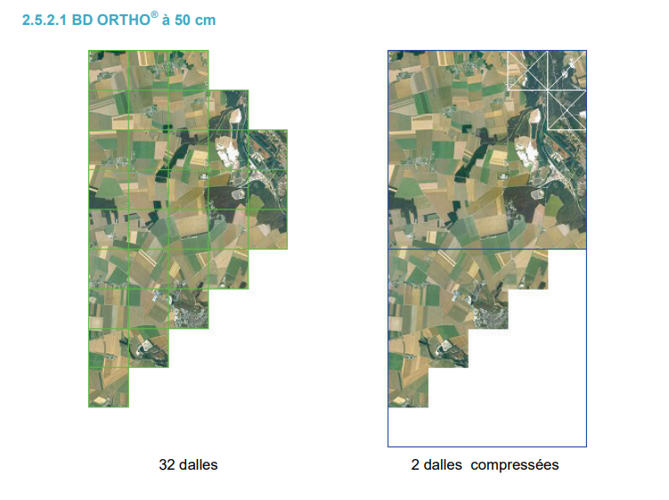

# Project log

## 23/06/2026

Project's start. Definition and detailing of tasks to complete project. Integration on Github Projects.

## 24/06/2026

### Define project scope and success metrics

Goal : Detect and localize rugby fields in satellite imagery.

Output : One or more bounding boxes around detected rugby fields.

Primary metric:
- mAP@50 ≥ 0.75 on validation set

Secondary metrics:
- Recall ≥ 0.90
- Precision ≥ 0.85

Qualitative requirement:
- Must distinguish rugby fields from football/soccer fields.

Constraints:
- No existing annotated dataset
- Limited compute resources (8GB RAM computer)
- Satellite imagery only
- Limited labeling budget

MVP : Model that recognizes all types of fields.

### Data Sources Search

Copernicus project: EU satellite imagery publicly available for free. Poor resolution.
Google Earth: Great resolution, but license doesn't seem to allow for ML use.
IGN France: Great resolution, public. Database ORTHO, 20cm resolution.

CHOICE : Use of IGN's BDORTHO https://cartes.gouv.fr/rechercher-une-donnee/dataset/IGNF_BD-ORTHO
High resolution, publicly available.
Download of data for the Haute-Garonne departement for first exploration. Dataset at 7-zip format, divided in 8 directories. Each directory contains 1kmx1km squares of satellite images. The whole directory contains the images for a department.

## 26/06/2026

Creation of pipeline to pre-annotate data with bounding boxes thanks to coordinates gathered on OpenStreetMap.
Installed rasterio to handle files georeferenced (.tif, raw data from IGN's database), geopandas to manipulate them (add bounding boxes etc...).